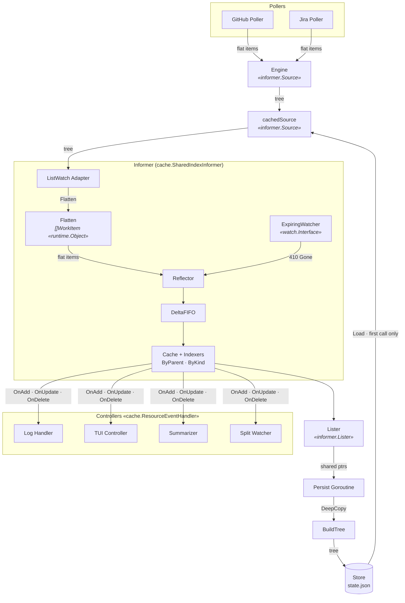

# Architecture

Pulse uses a Kubernetes-style informer pattern to poll upstream sources, cache work items, and dispatch change events to controllers. Persistence is decoupled from the informer — a periodic goroutine snapshots the cache to disk for instant startup.

## Dataflow

## Components

**Pollers** fetch raw data from upstream APIs (GitHub PRs/checks/reviews, Jira issues). Each returns a flat list of WorkItems. Source-specific — no cross-poller awareness.

**Engine** assembles the tree from flat poller results. Matches PRs to Jira issues by regex, detects orphan PRs, groups local work. Implements `informer.Source` — the informer drives poll scheduling, not the engine.

**cachedSource** wraps Store and Engine behind the `Source` interface. First `List()` call returns persisted state from disk (instant startup). Subsequent calls delegate to Engine (live data). Signals readiness via `LiveReady()` channel after the first live poll completes.

**Informer** is a `cache.SharedIndexInformer` from client-go. The `ListWatch` adapter calls `cachedSource.List()`, flattens the tree (setting OwnerReferences, clearing Children), and feeds flat items into the reflector. DeltaFIFO handles change detection. Items are indexed by `ByParent` (tree reconstruction) and `ByKind` (filtering). See [ADR-0001](docs/adr/0001-informer-pattern-for-data-flow.md).

**ExpiringWatcher** triggers relist at `pollInterval` by sending HTTP 410 Gone to the reflector. No real watch stream — polling is the only data source. Opts out of WatchList semantics since it doesn't support the bookmark protocol.

**Lister** provides read-only access to the informer cache. Returns shared pointers — callers must not mutate (standard K8s lister convention). Methods: `List()`, `Get(id)`, `ByIndex(indexName, key)`.

**Controllers** register via `AddEventHandler` and receive `OnAdd`/`OnUpdate`/`OnDelete` callbacks. Current: log handler. Planned: TUI (channel → bubbletea Cmd), Summarizer (LLM on new reviews), Split watcher (prune dead Supacode splits).

**Store** persists the WorkItem tree as JSON to `~/.local/state/pulse/state.json`. Writes atomically (tmp + fsync + rename). Reads tolerantly — missing file → empty tree, corrupt JSON → empty tree, invalid specs → dropped, unknown kinds → kept with nil ParsedSpec. See [ADR-0004](docs/adr/0004-persistence-as-periodic-snapshot.md).

**Persist Goroutine** snapshots the cache to disk periodically. Waits for the first live poll (via `cachedSource.LiveReady()`) before starting — avoids re-saving stale cached data. Flow: `Lister.List()` → `BuildTree` (DeepCopies items) → `Store.Save`. No final save on shutdown — state is a cache, pollers hold ground truth, and losing the last interval is acceptable.

## Startup Sequence

1. Load config, construct clients, create Store and Engine
2. Create `cachedSource` (wraps Store + Engine)
3. Create informer with `cachedSource` as `Source`
4. Register controllers via `AddEventHandler`
5. Start informer — reflector calls `cachedSource.List()`
6. First call: `Store.Load()` returns persisted tree → informer flattens and caches → fires Add events for all items → TUI renders instantly
7. `WaitForCacheSync` returns
8. Persist goroutine starts, waits for `LiveReady()`
9. ExpiringWatcher fires after `pollInterval` → reflector relists
10. Second `List()` call: `cachedSource` delegates to Engine (live data) → closes `liveC`
11. Informer diffs against cached state → fires Update/Delete events for real changes only
12. Persist goroutine unblocks, saves live state, starts periodic ticker
